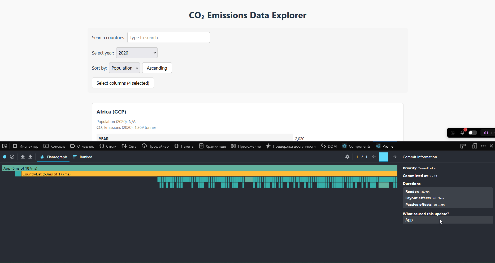
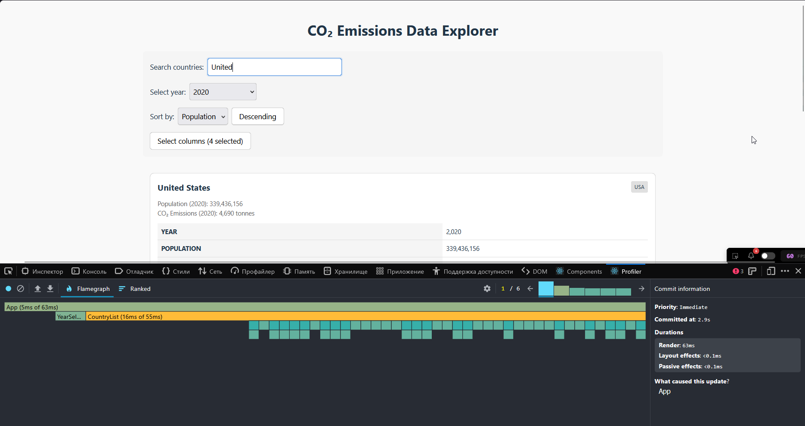
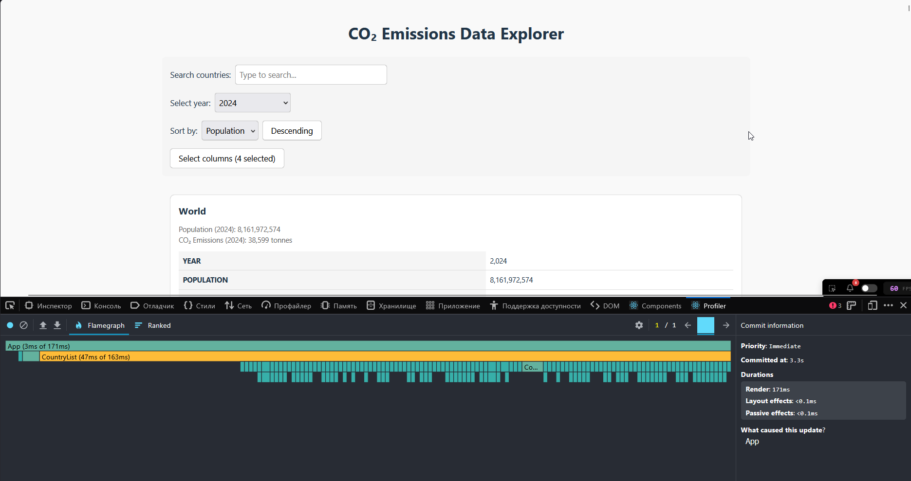
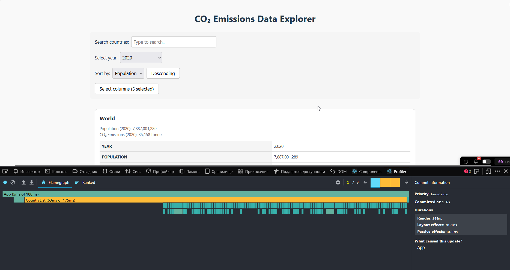
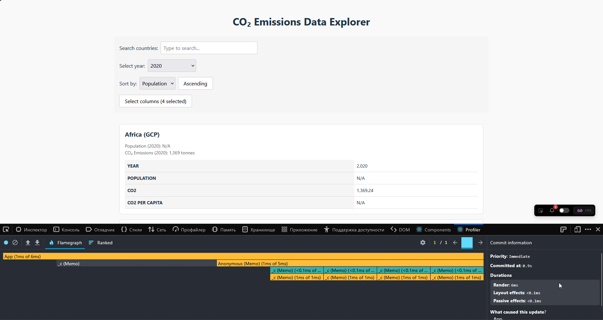
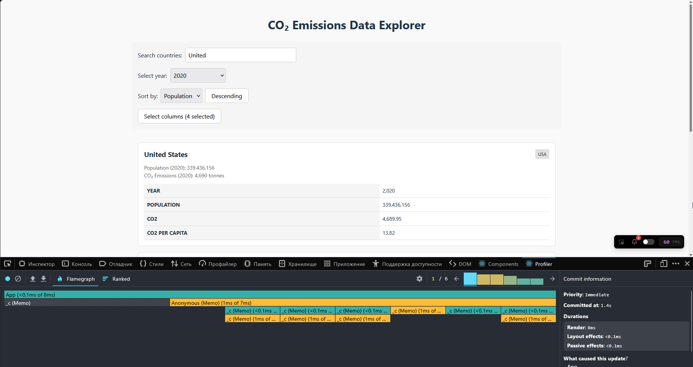
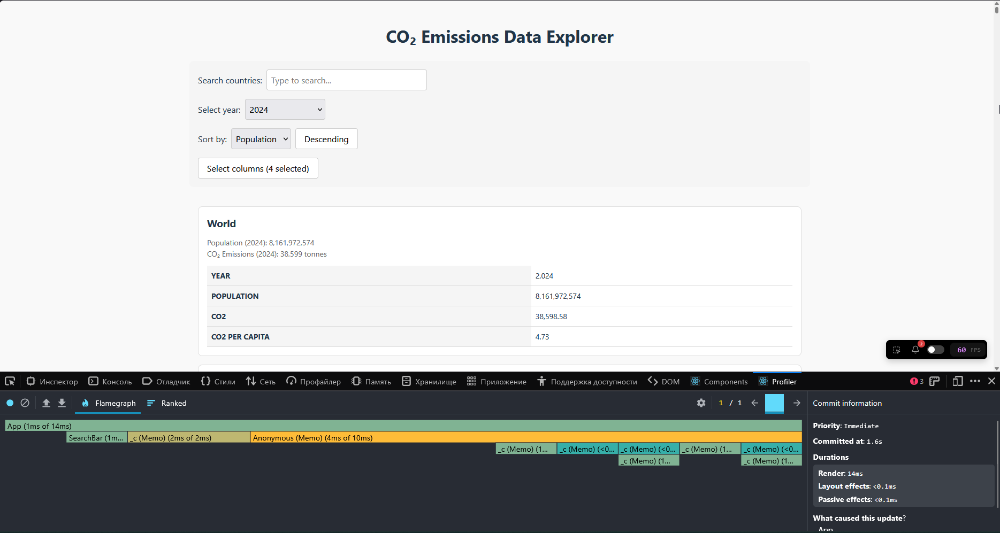
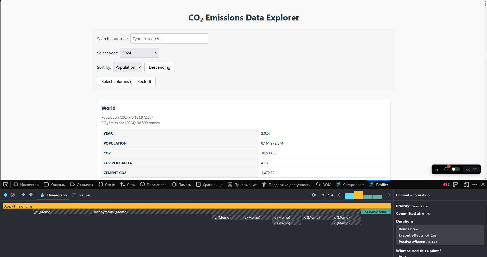

# Performance Optimization Report

## Baseline Measurements

### Interaction A: Sort countries

- **Commit duration**: 2.3 s
- **Render duration**: 187 ms
- **Screenshot**: 

### Interaction B: Search countries

- **Commit duration**: 2.9 s
- **Render duration**: 63 ms
- **Screenshot**: 

### Interaction C: Change year

- **Commit duration**: 3.3 s
- **Render duration**: 171 ms
- **Screenshot**: 

### Interaction D: Toggle column

- **Commit duration**: 1.6 s
- **Render duration**: 188 ms
- **Screenshot**: 

---

## Optimized Measurements

### Interaction A: Sort countries

- **Commit duration**: 0.9 s
- **Render duration**: 6 ms
- **Screenshot**: 

### Interaction B: Search countries

- **Commit duration**: 1.4 s
- **Render duration**: 8 ms
- **Screenshot**: 

### Interaction C: Change year

- **Commit duration**: 1.6 s
- **Render duration**: 14 ms
- **Screenshot**: 

### Interaction D: Toggle column

- **Commit duration**: 0.7 s
- **Render duration**: 3 ms
- **Screenshot**: 

## Summary of Improvements

| Interaction      | Baseline (ms) | Optimized (ms) | Improvement |
| ---------------- | ------------- | -------------- | ----------- |
| Sort countries   | 187           | 6              | 96.79%      |
| Search countries | 63            | 8              | 87.30%      |
| Change year      | 171           | 14             | 91.81%      |
| Toggle column    | 188           | 3              | 98.40%      |
| **Average**      | **152**       | **8**          | **93.58%**  |